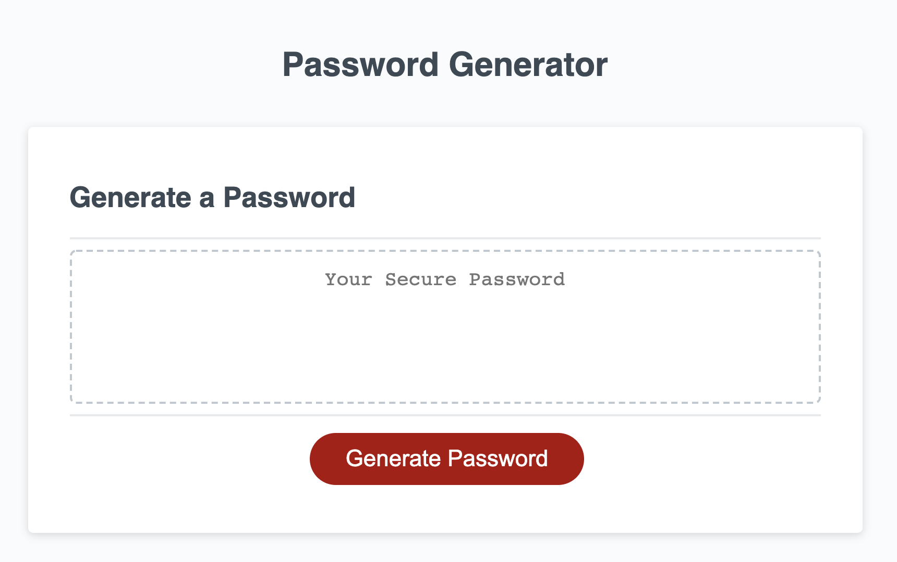
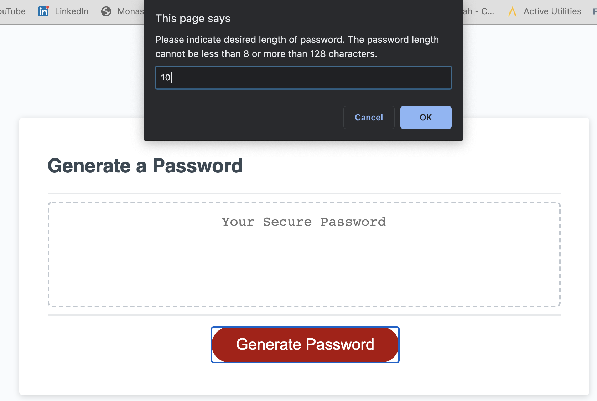
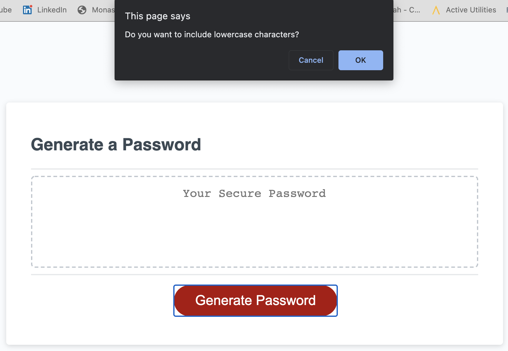
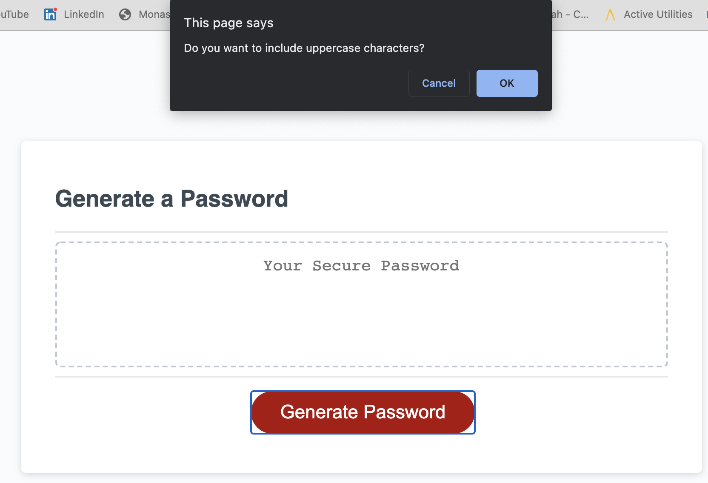
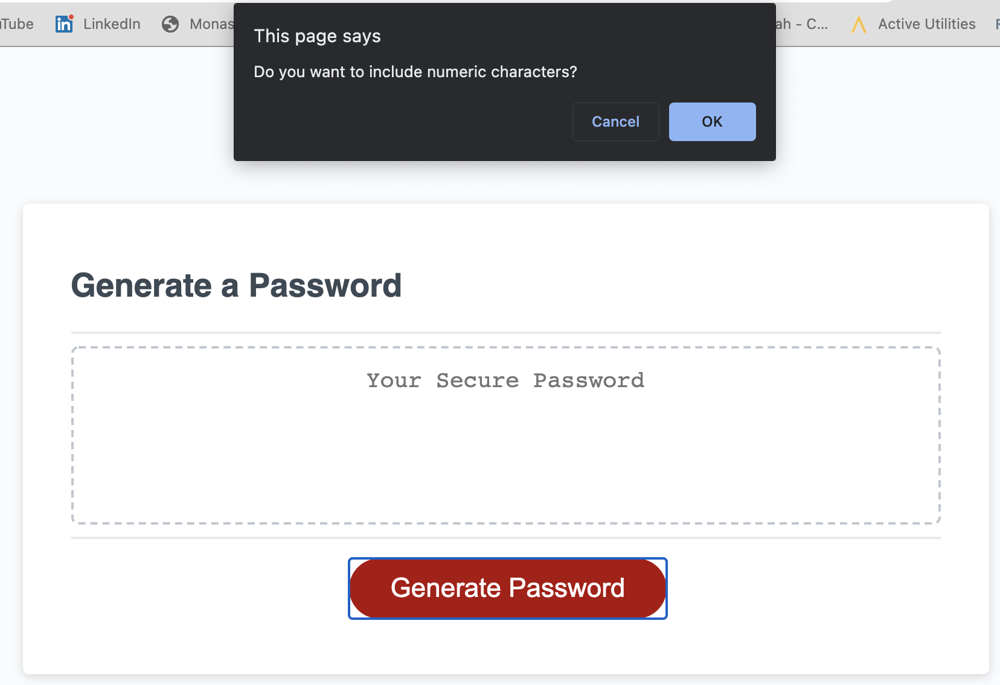
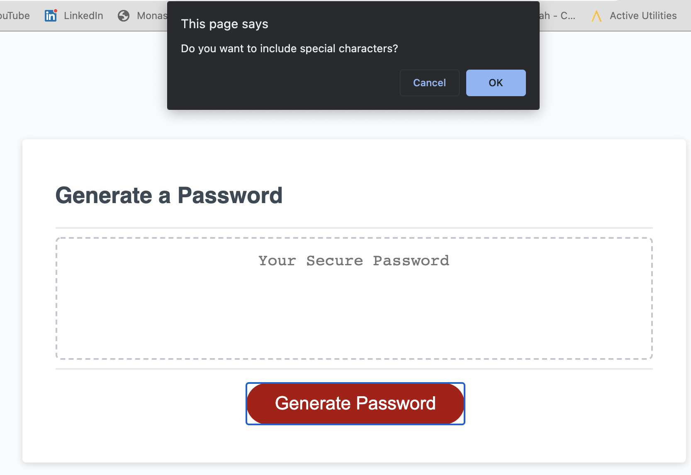
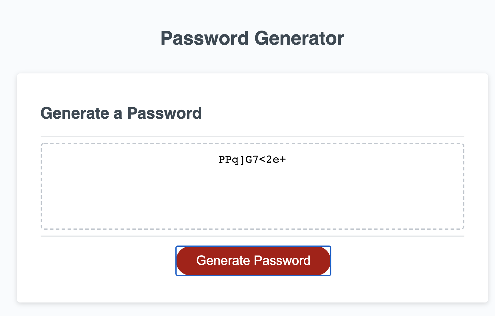

# JavaScript: Password Generator
Project Owner - Aaron Au Yoong 
 
View live link here: https://aaronauyoong.github.io/JS-Password-Generator/.

## Table of Contents
* [Introduction](#Introduction)
* [Technologies](#Technologies)
* [Deliverables](#Deliverables)
* [Functionalities](#Functionalities)
* [Screenshots](#Screenshots)
* [License](#License)

## Introduction
People's sensitive data need to be protected in this day and age. Through the usage of this password generator, users are able to randomly generate a desirable password to protect their data. Users are able to customise their password to meet their needs, by selecting a length between 8 to 128 characters, and other criteria such as lowercase, uppercase, numeric and special characters. 

## Technologies
Technologies used in this password generator include:
- HTML page for the main website. 
- CSS Stylesheet to style the website.
- Javascript page to create the password generator.

## Deliverables
Below are the password generator project requirements:
- When users click on the button to generate a password, a series of prompts will appear for them to choose password criteria
- Users can choose a length of at least 8 characters and no more than 128 characters
- Users can choose to include lowercase, uppercase, numeric, and/or special characters
- Users' answers to each prompt need to be validated and at least one character type should be selected
- Once all prompts are answered, a password will be generated that matches their selected  criteria
- Generated password will appear on the page

## Functionalities
- Users are required to answer to at least one of the criteria (e.g. uppercase, lowercase). If all are not answered, an alert will appear, prompting users to answer again to ensure a password will be generated. 

## Screenshots
Screenshots of the application are below. 

1. How the page looks upon loading.
 

 
 

2. First prompt for desired password length.
 

 
 

3. Second prompt for lowercase characters criteria.
 

 
 

4. Third prompt for uppercase characters criteria.
 

 
 

5. Fourth prompt for numeric characters criteria.
 

 
 

6. Fifth prompt for special characters criteria. 
 

 
 

7. Password generated in text box. 
 

 
 

## Improvements
Version 1.0 - Prompts used as per project requirements to aid user in generating password. Moving forward, can perhaps consider a less "disruptive" approach for a password generator app, such as using forms. 

## License
Copyright (c) 2021-Present Aaron Au Yoong. All rights reserved.